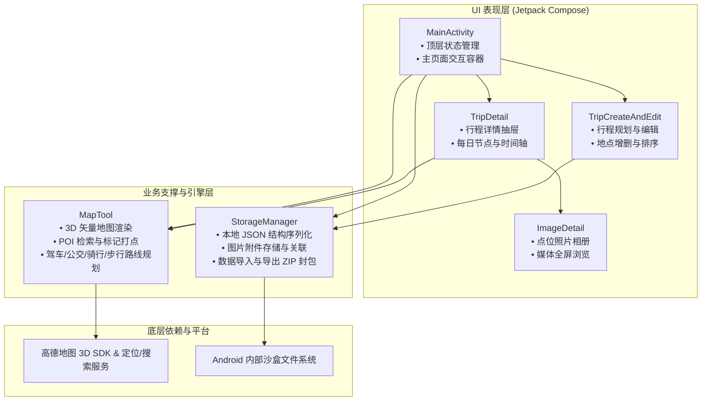
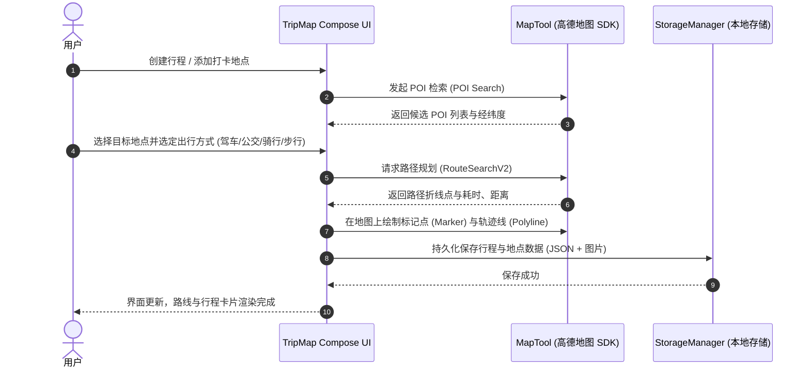

<div align="center">

# 🗺️ TripMap (行程地图助手)

**基于 Jetpack Compose 与高德地图 3D SDK 构建的轻量、端侧安全型个人行程与足迹规划应用**

[](https://developer.android.com)
[](https://kotlinlang.org)
[](https://developer.android.com/jetpack/compose)
[](https://gradle.org)
[](LICENSE)

</div>

---

> 💡 **给 AI Agent 用户的极速上手指令**：
> 如果你正在使用 AI 编程助手（如 Windsurf、Cursor、Claude Code 或 Antigravity），无需手动逐行配置，克隆本项目后直接对你的 Agent 发送：
> ```text
> 请阅读本项目 README.md，帮我检查当前电脑的 Android SDK 与 JDK 环境，根据 local.properties.example 创建 local.properties 并引导我配置高德地图 API Key，最后执行项目构建。
> ```

---

## 📖 项目简介与痛点分析

在旅行、商务出差、户外徒步或城市漫步等场景下，用户经常需要：
- **点位与打卡记录**：把分散的景点、餐饮、酒店和打卡地标串联成每日清晰的行程；
- **照片与记忆关联**：将旅途中的照片关联到具体打卡点，在地图上直观回溯空间记忆；
- **多模式通勤规划**：随时在地图上直观比对驾车、公交、骑行、步行等路径规划与通行耗时；
- **端侧隐私与离线便携**：无需依赖第三方云端数据库，数据完全存储于本地设备，支持一键备份与导入。

**TripMap** 采用现代 Android 技术栈（Jetpack Compose + Material 3 + Kotlin 协程），结合高德地图 3D 矢量地图引擎与 POI/路线规划能力，打造了一款界面清爽、流畅跟手、端侧离线可用的行程足迹助手。

---

## 🏛️ 系统架构设计与交互流程

项目采用清晰的分层架构，UI 交互完全基于 Jetpack Compose 响应式状态流，地图能力与底层服务封装于 `MapTool`，本地持久化由 `StorageManager` 托管。

### 1. 核心架构拓扑



### 2. 行程规划与路线计算时序



---

## ✨ 核心功能特性

- **📱 响应式现代界面**：
  - 基于 Jetpack Compose 打造，支持 Material 3 动态配色与系统深色模式无缝自适应；
  - 丝滑的可伸缩底部抽屉（BottomSheet）手势交互，兼顾地图浏览与信息列表操作。
- **📍 多维打卡点位管理**：
  - 支持每日多节点行程添加、编辑、删除与拖拽重排；
  - 每个点位支持绑定多张照片，并在地图上呈现直观的打卡图标与照片预览。
- **🧭 全场景路径与通勤规划**：
  - 集成高德地图路径规划算法，支持**驾车**、**公交/地铁**、**骑行**、**步行** 4 种通勤模式的路线与耗时估算；
  - 地图端自动适应可视区域范围（Camera Bounds Auto-fit），一览当日所有途经点。
- **🔒 隐私优先与本地封包备份**：
  - 核心数据完全存储在本地沙盒目录中，不收集任何用户隐私数据；
  - 支持将行程节点与关联照片打包导出为离线 `.zip` 归档文件，便于换机迁移与备份。

---

## 🛠️ 技术栈与依赖库

| 领域 | 选型 | 说明 |
| :--- | :--- | :--- |
| **开发语言** | Kotlin 2.0.21 | 简洁、安全且支持最新 Compose 编译器插件 |
| **界面框架** | Jetpack Compose + Material 3 | 声明式响应式 UI、沉浸式边缘到边缘（Edge-to-Edge）设计 |
| **地图引擎** | 高德地图 3D Android SDK (v11.1) | 3D 矢量地图渲染、图层切换、标记物绘制 |
| **位置与搜索** | 高德定位与检索 SDK (v9.7) | 逆地理编码、城市 POI 联想搜索、路径规划 |
| **图片加载** | Coil Compose (v2.6.0) | 内存高效的异步图片与缩略图加载 |
| **序列化** | Google Gson (v2.10.1) | 本地配置与行程数据结构序列化 |
| **构建系统** | Gradle 8.11 + AGP 8.11.2 | Gradle Version Catalog (`libs.versions.toml`) 依赖管理 |

---

## 🚀 快速上手与本地运行

### 前置环境需求
- **JDK**：OpenJDK 17 或以上
- **Android SDK**：Compile SDK 35，Min SDK 24 (Android 7.0+)
- **Android Studio**：Android Studio Ladybug / Iguana 或更新版本

### 第一步：克隆仓库
```bash
git clone https://github.com/<你的用户名>/TripMap.git
cd TripMap
```

### 第二步：配置环境与高德 API Key
1. 复制根目录下的配置模板：
   ```bash
   cp local.properties.example local.properties
   ```
2. 前往 [高德开放平台控制台](https://lbs.amap.com/) 创建应用，添加一个 **Android 平台 Key**：
   - **PackageName**：`com.example.tripmap`
   - **SHA1 证书指纹**：填写你的本地 debug 证书或发布证书的 SHA1 指纹
3. 打开 `local.properties` 文件，填入你申请的 API Key：
   ```properties
   AMAP_API_KEY=你的高德地图APIKey
   ```
   > 📌 **安全提示**：`local.properties` 已被项目 `.gitignore` 严格忽略，你的真实 Key 和本地路径绝不会被提交到 Git 仓库。

### 第三步：编译与运行
- **通过 Android Studio 运行**：
  打开项目根目录，等待 Gradle 同步完成后，点击顶部工具栏的 **Run 'app'** 绿色三角形按钮。
- **通过命令行编译 Debug APK**：
  ```bash
  # Windows PowerShell
  .\gradlew.bat assembleDebug

  # Linux / macOS
  ./gradlew assembleDebug
  ```
  编译产物路径位于：`app/build/outputs/apk/debug/app-debug.apk`。

---

## 📦 项目目录结构说明

```text
TripMap/
├── app/                                 # 核心业务模块
│   ├── libs/                            # 本地依赖库
│   ├── src/main/
│   │   ├── java/com/example/tripmap/
│   │   │   ├── MainActivity.kt          # 核心 Activity 与顶层状态流
│   │   │   ├── MapTool.kt               # 高德地图接口封装、POI 搜索与路线规划
│   │   │   ├── TripCreateAndEdit.kt     # 行程新建与节点编辑界面
│   │   │   ├── TripDetail.kt            # 行程详情展示与节点管理
│   │   │   ├── ImageDetail.kt           # 打卡点照片预览与相册管理
│   │   │   └── ui/theme/                # Material 3 主题、色彩与字体排版
│   │   └── res/                         # 图片资源、布局与元数据配置
│   ├── build.gradle.kts                 # App 模块构建逻辑与 Key 占位符注入
│   └── proguard-rules.pro               # 混淆规则配置
├── gradle/                              # Gradle Wrapper 与依赖版本目录
├── local.properties.example             # 本地环境配置模板（供开源用户参考）
├── .gitignore                           # 严密过滤规则（防止签名与敏感配置泄露）
├── build.gradle.kts                     # 顶层构建配置
├── settings.gradle.kts                  # 模块声明与 Maven 仓库源
└── LICENSE                              # Apache 2.0 开源许可证
```

---

## 🔒 隐私与安全合规说明

1. **零服务端依赖**：本项目不架设任何自建中转服务器，行程数据、时间线与图片纯本地沙盒存储；
2. **敏感配置隔离**：项目通过 Gradle 构建脚本动态读取 `local.properties` 中的 API Key 与签名证书，杜绝在 Git 历史中遗留任何凭据；
3. **权限最小化原则**：仅声明网络访问（加载高德矢量地图瓦片）与粗略/精确定位权限（用于自身定位图层展示）。

---

## 📄 开源许可证

本项目基于 [Apache License 2.0](LICENSE) 开源。欢迎提交 Issue 与 Pull Request 共同改进！
